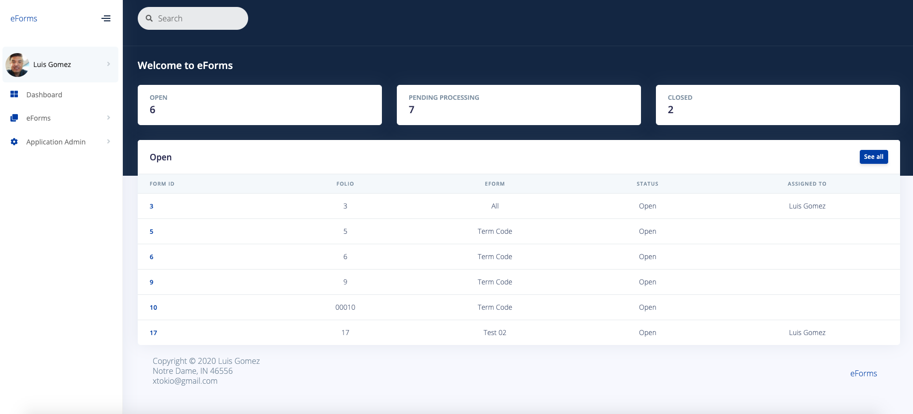
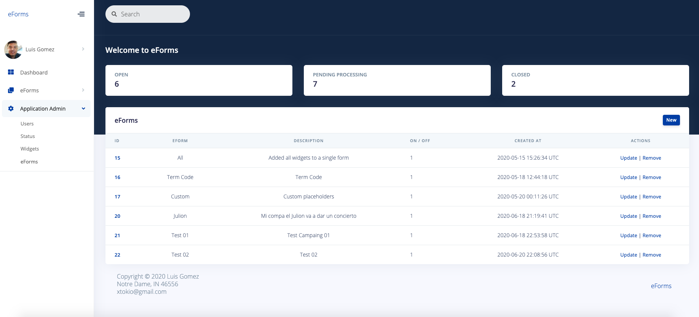

# eForms
Simple forms creation and follow ups

https://app.mischicanadas.com/eforms
User: `lgomez`
Pass: `lgomez`

##### Screenshots

Login


Dashboard


Forms


Forms creation


Forms Widgets


## Installation

#### Crystal version `0.34.0`

###### Install shards
```crystal
shards install
```
###### Compile
```crystal
crystal build src/eforms.cr --release
```

##### ENV
`.env` file must have your own values
```bash
ROOT_PATH=/Users/luis/Desktop/Code/Crystal/apps
DATABASE_PATH=/Users/luis/Desktop/Code/Crystal/apps/eforms/db/dialercr.db
PUBLIC_PATH=/Users/luis/Desktop/Code/Crystal/apps/eforms/public
PORT=3000
```

## Usage

##### Widgets
When creating a `widget` use the following template to customize your own widgets
```html
<fieldset>
    <legend>Datos de vivienda</legend>
    <div data-row-span="2">
      <div data-field-span="1">
        <label>Direccion calle y numero</label>
        <input id="txt_direccion" type="text">
      </div>
      <div data-field-span="1">
        <label>Colonia</label>
        <input id="txt_colonia" type="text">
      </div>
    </div>
    <div data-row-span="4">
      <div data-field-span="3">
        <label>Direccion de ubicacion o señas particulares de domicilio</label>
        <input id="txt_ubicacion_domicilio" type="text">
      </div>
      <div data-field-span="1">
        <label>Ciudad</label>
        <input id="txt_ciudad" type="text">
      </div>
    </div>
</fieldset>
```

## Contributing

1. Fork it (<https://github.com/xtokio/eforms/fork>)
2. Create your feature branch (`git checkout -b my-new-feature`)
3. Commit your changes (`git commit -am 'Add some feature'`)
4. Push to the branch (`git push origin my-new-feature`)
5. Create a new Pull Request

## Contributors

- [Luis Gomez](https://github.com/xtokio) - creator and maintainer
